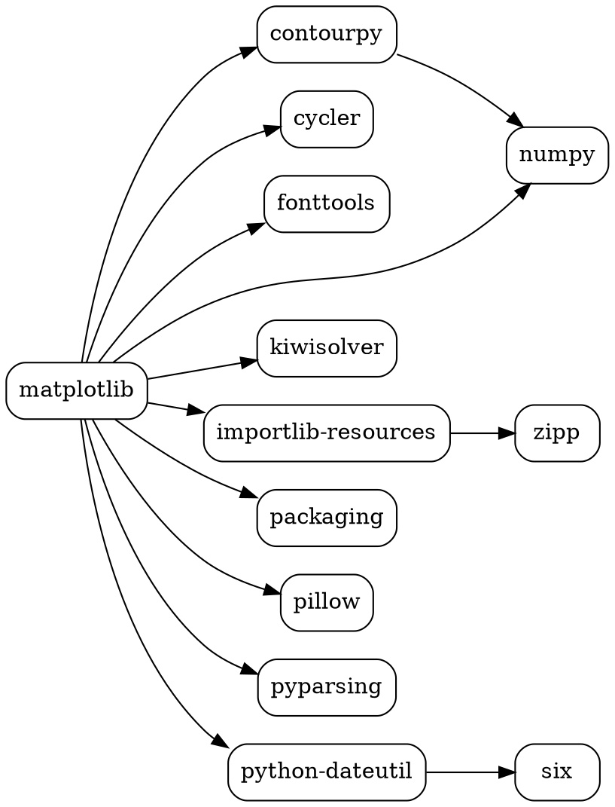
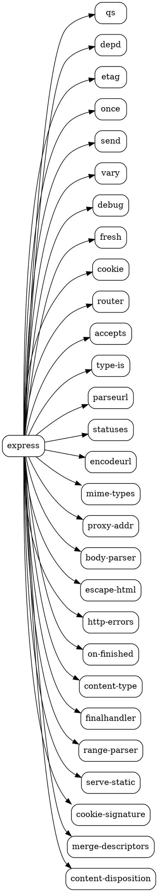

# Практическое занятие №2 — решение

## Задача 1

```bash
pip3 show matplotlib
```

```
Name: matplotlib
Version: 3.9.4
Summary: Python plotting package
Home-page: https://matplotlib.org
Author: John D. Hunter, Michael Droettboom
Author-email: Unknown <matplotlib-users@python.org>
License: License agreement for matplotlib versions 1.3.0 and later
         ...(текст лицензии опущен)...
Location: /Users/makarleonardov/Library/Python/3.9/lib/python/site-packages
Requires: contourpy, cycler, fonttools, importlib-resources, kiwisolver, numpy, packaging, pillow, pyparsing, python-dateutil
Required-by:
```

```bash
curl -O https://files.pythonhosted.org/packages/df/17/1747b4154034befd0ed33b52538f5eb7752d05bb51c5e2a31470c3bc7d52/matplotlib-3.9.4.tar.gz
```

## Задача 2

```bash
npm view express
```

```
express@5.2.1 | MIT | deps: 28 | versions: 289
Fast, unopinionated, minimalist web framework
https://expressjs.com/

keywords: express, framework, sinatra, web, http, rest, restful, router, app, api

dist
.tarball: https://registry.npmjs.org/express/-/express-5.2.1.tgz
.shasum: 8f21d15b6d327f92b4794ecf8cb08a72f956ac04
.integrity: sha512-hIS4idWWai69NezIdRt2xFVofaF4j+6INOpJlVOLDO8zXGpUVEVzIYk12UUi2JzjEzWL3IOAxcTubgz9Po0yXw==
.unpackedSize: 75.4 kB

dependencies:
qs: ^6.14.0, depd: ^2.0.0, etag: ^1.8.1, once: ^1.4.0, send: ^1.1.0, vary: ^1.1.2, debug: ^4.4.0, fresh: ^2.0.0, cookie: ^0.7.1, router: ^2.2.0, accepts: ^2.0.0, type-is: ^2.0.1, parseurl: ^1.3.3, statuses: ^2.0.1, encodeurl: ^2.0.0, mime-types: ^3.0.0, proxy-addr: ^2.0.7, body-parser: ^2.2.1, escape-html: ^1.0.3, http-errors: ^2.0.0, on-finished: ^2.4.1, content-type: ^1.0.5, finalhandler: ^2.1.0, range-parser: ^1.2.1
(...and 4 more.)

maintainers:
- wesleytodd <wes@wesleytodd.com>
- jonchurch <npm@jonchurch.com>
- ctcpip <c@labsector.com>
- ulisesgascon <ulisesgascondev@gmail.com>
- sheplu <jean.burellier@gmail.com>

dist-tags:
latest: 5.2.1
latest-4: 4.22.3

published 9 months ago by jonchurch <npm@jonchurch.com>
```

```bash
curl -O https://registry.npmjs.org/express/-/express-5.2.1.tgz
```

## Задача 3





```bash
dot -Tpng matplotlib_deps.dot -o matplotlib_deps.png
dot -Tpng express_deps.dot -o express_deps.png
```

## Задача 4

```minizinc
include "alldifferent.mzn";

array[1..6] of var 0..9: d;
var 0..27: s;

constraint alldifferent(d);
constraint d[1] + d[2] + d[3] = s;
constraint d[4] + d[5] + d[6] = s;

solve minimize s;

output ["Билет: "] ++ [show(d[i]) | i in 1..6] ++
       ["\nСумма трёх цифр (минимальная) = ", show(s)];
```

Результат: `s = 8` (например, билет `026134`: 0+2+6 = 1+3+4 = 8).

## Задача 5

```
root 1.0.0 зависит от menu ^1.0.0 и icons ^1.0.0.
menu 1.0.0 и 1.1.0 зависят от dropdown ^1.8.0.
menu 1.2.0, 1.3.0, 1.4.0, 1.5.0 зависят от dropdown ^2.0.0.
dropdown (1.8.0 .. 2.3.0) не имеет зависимостей.
icons (1.0.0, 2.0.0) не имеет зависимостей.
```

```minizinc
enum PkgVer = { Root_100,
                Menu_100, Menu_110, Menu_120, Menu_130, Menu_140, Menu_150,
                Dropdown_180, Dropdown_200, Dropdown_210, Dropdown_220, Dropdown_230,
                Icons_100, Icons_200 };

array[PkgVer] of var bool: install;

constraint install[Root_100];

constraint install[Menu_100] + install[Menu_110] + install[Menu_120]
         + install[Menu_130] + install[Menu_140] + install[Menu_150] <= 1;
constraint install[Dropdown_180] + install[Dropdown_200] + install[Dropdown_210]
         + install[Dropdown_220] + install[Dropdown_230] <= 1;
constraint install[Icons_100] + install[Icons_200] <= 1;

constraint install[Root_100] -> (install[Menu_100] \/ install[Menu_110] \/ install[Menu_120]
                               \/ install[Menu_130] \/ install[Menu_140] \/ install[Menu_150]);
constraint install[Root_100] -> install[Icons_100];

constraint install[Menu_100] -> install[Dropdown_180];
constraint install[Menu_110] -> install[Dropdown_180];

constraint install[Menu_120] -> (install[Dropdown_200] \/ install[Dropdown_210] \/ install[Dropdown_220] \/ install[Dropdown_230]);
constraint install[Menu_130] -> (install[Dropdown_200] \/ install[Dropdown_210] \/ install[Dropdown_220] \/ install[Dropdown_230]);
constraint install[Menu_140] -> (install[Dropdown_200] \/ install[Dropdown_210] \/ install[Dropdown_220] \/ install[Dropdown_230]);
constraint install[Menu_150] -> (install[Dropdown_200] \/ install[Dropdown_210] \/ install[Dropdown_220] \/ install[Dropdown_230]);

var int: score =
      1*bool2int(install[Menu_100])     + 2*bool2int(install[Menu_110])
    + 3*bool2int(install[Menu_120])     + 4*bool2int(install[Menu_130])
    + 5*bool2int(install[Menu_140])     + 6*bool2int(install[Menu_150])
    + 1*bool2int(install[Dropdown_180]) + 2*bool2int(install[Dropdown_200])
    + 3*bool2int(install[Dropdown_210]) + 4*bool2int(install[Dropdown_220])
    + 5*bool2int(install[Dropdown_230])
    + 1*bool2int(install[Icons_100])    + 2*bool2int(install[Icons_200]);

solve maximize score;

output [ if fix(install[pv]) then show(pv) ++ " " else "" endif | pv in PkgVer ];
```

## Задача 6

```minizinc
enum PkgVer = { Root_100,
                Foo_100, Foo_110,
                Left_100,
                Right_100,
                Shared_100, Shared_200,
                Target_100, Target_200 };

array[PkgVer] of var bool: install;

constraint install[Root_100];

constraint install[Foo_100] + install[Foo_110] <= 1;
constraint install[Shared_100] + install[Shared_200] <= 1;
constraint install[Target_100] + install[Target_200] <= 1;

constraint install[Root_100] -> (install[Foo_100] \/ install[Foo_110]);
constraint install[Root_100] -> install[Target_200];

constraint install[Foo_110] -> install[Left_100];
constraint install[Foo_110] -> install[Right_100];

constraint install[Left_100] -> (install[Shared_100] \/ install[Shared_200]);

constraint install[Right_100] -> install[Shared_100];

constraint install[Shared_100] -> install[Target_100];

solve minimize sum(pv in PkgVer)(install[pv]);

output [ if fix(install[pv]) then show(pv) ++ " " else "" endif | pv in PkgVer ];
```

## Задача 7

```python
import json
import re
import tarfile
import urllib.request

from semantic_version import NpmSpec, Version
from z3 import AtMost, Bool, If, Implies, Optimize, Or, Sum, is_true

pj = json.load(tarfile.open("express-5.2.1.tgz").extractfile("package/package.json"))
root = (pj["name"], pj["version"])

reg = {pj["name"]: {pj["version"]: pj}}
META = {}
todo = [(pj["name"], NpmSpec(pj["version"]))]
while todo:
    pkg, spec = todo.pop()
    if pkg not in reg:
        reg[pkg] = json.load(urllib.request.urlopen("https://registry.npmjs.org/" + pkg))["versions"]
    for v, info in reg[pkg].items():
        if Version(v) in spec and v not in META.setdefault(pkg, {}):
            META[pkg][v] = [(d, NpmSpec(re.sub(r"([<>=^~]+)\s+", r"\1", r)))
                            for d, r in info.get("dependencies", {}).items()]
            todo += META[pkg][v]

x = {(p, v): Bool(f"{p} {v}") for p in META for v in META[p]}
s = Optimize()
s.add(x[root])
for p in META:
    s.add(AtMost(*[x[p, v] for v in META[p]], 1))
for (p, v), var in x.items():
    for d, spec in META[p][v]:
        s.add(Implies(var, Or([x[d, w] for w in META[d] if Version(w) in spec])))
s.minimize(Sum([If(var, 1, 0) for var in x.values()]))

s.check()
m = s.model()
for (p, v), var in sorted(x.items()):
    if is_true(m.eval(var)):
        print(p, v)
```

```
accepts 2.0.0
body-parser 2.2.2
bytes 3.1.2
call-bind-apply-helpers 1.0.1
call-bound 1.0.3
content-disposition 1.1.0
content-type 1.0.5
cookie 0.7.2
cookie-signature 1.2.1
debug 4.4.3
depd 2.0.0
dunder-proto 1.0.0
ee-first 1.1.1
encodeurl 2.0.0
es-define-property 1.0.1
es-errors 1.3.0
es-object-atoms 1.1.0
escape-html 1.0.3
etag 1.8.1
express 5.2.1
finalhandler 2.1.0
forwarded 0.2.0
fresh 2.0.0
function-bind 1.1.2
get-intrinsic 1.2.6
gopd 1.2.0
has-symbols 1.1.0
hasown 2.0.3
http-errors 2.0.1
iconv-lite 0.7.0
inherits 2.0.4
ipaddr.js 1.9.1
is-promise 4.0.0
math-intrinsics 1.1.0
media-typer 1.1.1
merge-descriptors 2.0.0
mime-db 1.54.0
mime-types 3.0.2
ms 2.1.3
negotiator 1.0.0
object-inspect 1.13.4
on-finished 2.4.1
once 1.4.0
parseurl 1.3.3
path-to-regexp 8.2.0
proxy-addr 2.0.7
qs 6.14.1
range-parser 1.3.0
raw-body 3.0.2
router 2.2.0
safer-buffer 2.1.2
send 1.2.0
serve-static 2.2.0
setprototypeof 1.2.0
side-channel 1.1.1
side-channel-list 1.0.1
side-channel-map 1.0.1
side-channel-weakmap 1.0.2
statuses 2.0.2
toidentifier 1.0.1
type-is 2.0.1
unpipe 1.0.0
vary 1.1.2
wrappy 1.0.2
```